# IfcDoorTypeOperationEnum

This enumeration defines the basic ways to describe how an _IfcDoor_ or _IfcDoorType_ operate, as shown in Figure 1. It combines the partitioning of the access barrier into single or multiple panels and the operation types of those panels.

In the most common case of swinging doors the _IfcDoorTypeOperationEnum_ defined the hinge side (left hung or right hung) and the opening direction (opening to the left, opening to the right). Whether the door opens inwards or outwards is determined by the local coordinate system of the _IfcDoor_

> NOTE  There are different definitions in various countries on what a left opening or left hung or left swing door is (same for right). Therefore the IFC definition terms may derive from the local standard and may need to be mapped appropriately.

> HISTORY  New Enumeration in IFC4.

{ .change-ifc2x4}
> IFC4 CHANGE The new _IfcDoorTypeOperationEnum_ replaces the use of _IfcDoorStyleOperationEnum_ that is deprecated from IFC4 onwards.

Note that:

1. Figures are shown in the ground view.
2. Figures (symbolic representation) depend on the national building code.
3. These figures/ are only shown as illustrations, the actual representation in the ground view might differ.
4. Open to the outside is declared as open into the direction of the positive y-axis, determined by the _ObjectPlacement_ at _IfcDoor_
5. The location of the panel relative to the wall thickness is defined by the _ObjectPlacement_ at _IfcDoor_, and the _IfcDoorLiningProperties.LiningOffset_ parameter.

## Items

### SINGLE_SWING_LEFT
Door with one panel that opens (swings) to the left. The hinges are on the left side as viewed in the direction of the positive y-axis.

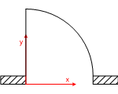

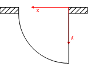

### SINGLE_SWING_RIGHT
Door with one panel that opens (swings) to the right. The hinges are on the right side as viewed in the direction of the positive y-axis.

> NOTE  Direction of swing (whether in or out) is determined at the <em>IfcDoor</em>.

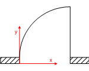

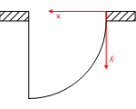

### DOUBLE_PANEL_SINGLE_SWING
Door with two panels, one opens (swings) to the left the other opens (swings) to the right.

> NOTE  Direction of swing (whether in or out) is determined at the <em>IfcDoor</em>.

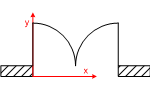

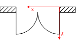

### DOUBLE_PANEL_SINGLE_SWING_OPPOSITE_LEFT
Door with two panels that both open to the left, one panel swings in one direction and the other panel swings in the opposite direction.

> NOTE  Direction of swing (whether in or out) is determined at the <em>IfcDoor</em>.

### DOUBLE_PANEL_SINGLE_SWING_OPPOSITE_RIGHT
Door with two panels that both open to the right, one panel swings in one direction and the other panel swings in the opposite direction.

> NOTE  Direction of swing (whether in or out) is determined at the <em>IfcDoor</em>.

### DOUBLE_SWING_LEFT
Door with one panel that swings in both directions and to the left in the main trafic direction. Also called double acting door.

> NOTE  Direction of swing (whether in or out) is determined at the <em>IfcDoor</em>.

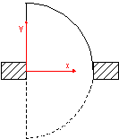

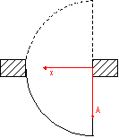

### DOUBLE_SWING_RIGHT
Door with one panel that swings in both directions and to the right in the main trafic direction. Also called double acting door.

> NOTE  Direction of swing (whether in or out) is determined at the <em>IfcDoor</em>.

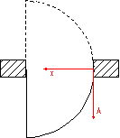

### DOUBLE_PANEL_DOUBLE_SWING
Door with two panels, one swings in both directions and to the right in the main trafic direction the other swings also in both directions and to the left in the main trafic direction.

> NOTE  Direction of swing (whether in or out) is determined at the <em>IfcDoor</em>.

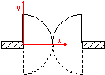

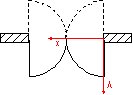

### SLIDING_TO_LEFT
Door with one panel that is sliding to the left.

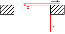

### SLIDING_TO_RIGHT
Door with one panel that is sliding to the right.

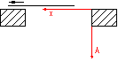

### DOUBLE_PANEL_SLIDING
Door with two panels, one is sliding to the left the other is sliding to the right.

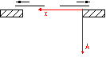

### FOLDING_TO_LEFT
Door with one panel that is folding to the left.

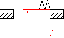

### FOLDING_TO_RIGHT
Door with one panel that is folding to the right.

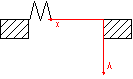

### DOUBLE_PANEL_FOLDING
Door with two panels, one is folding to the left the other is folding to the right.

### REVOLVING_HORIZONTAL
An entrance door consisting of four leaves set in a form of a cross and revolving around a central vertical axis (the four panels are described by a single _IfcDoor_ panel property).

### ROLLINGUP
Door that opens by rolling up.

> NOTE  Whether it rolls up to the inside or outside is determined at the <em>IfcDoor</em>.

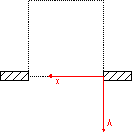

### SWING_FIXED_LEFT
Door with one panel that opens (swings) to the left and one fixed panel. The hinges of the swinging panel are on the left side as viewed in the direction of the positive y-axis.

> NOTE  Direction of swing (whether in or out) is determined at the <em>IfcDoor</em>.

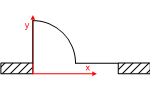

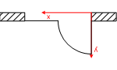

### SWING_FIXED_RIGHT
Door with one panel that opens (swings) to the right and one fixed panel. The hinges of the swinging panel are on the right side as viewed in the direction
of the positive y-axis.

> NOTE  Direction of swing (whether in or out) is determined at the <em>IfcDoor</em>.

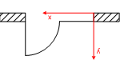

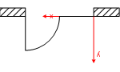

### DOUBLE_PANEL_LIFTING_VERTICAL

### LIFTING_HORIZONTAL

### LIFTING_VERTICAL_LEFT

### LIFTING_VERTICAL_RIGHT

### REVOLVING_VERTICAL

### USERDEFINED
User defined operation type.

### NOTDEFINED
A door with a not defined operation type is considered as a door with a lining, but no panels. It is thereby always open.

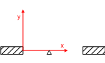
