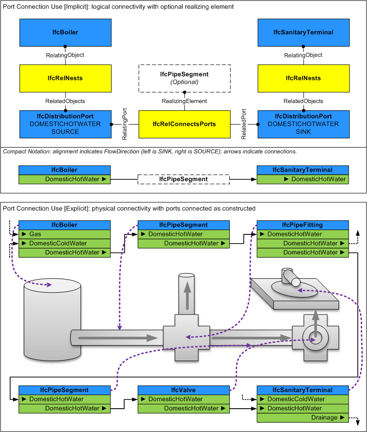

# IfcDistributionPort

A distribution port is an inlet or outlet of a product through which a particular substance may flow.

Distribution ports are used for passage of solid, liquid, or gas substances, as well as electricity for power or communications. Flow segments (pipes, ducts, cables) may be used to connect ports across products. Distribution ports are defined by system type and flow direction such that for two ports to be connected, they must share the same system type and have opposite flow directions (one side being a _SOURCE_ and the other being a _SINK_). Ports are similar to openings in that they do not have any visible geometry; such geometry is captured at the shape representation of the enclosing element or element type. Ports may have placement that indicates the position and orientation of the connection.

Ports are assigned the distribution systems in order to indicate its role in a particular system, e.g. cold water inlet.

> HISTORY  New entity in IFC2x2

{ .change-ifc2x4}
> IFC4 CHANGE  Ports are now related to products and product types using the _IfcRelNests_ relationship; use of _IfcRelConnectsPortToElement_ is now reserved for dynamically attached ports (such as drilling a hole in a tank).

## Attributes

### FlowDirection
Enumeration that identifies if this port is a Sink (inlet), a Source (outlet) or both a SinkAndSource.

### PredefinedType

### SystemType
Enumeration that identifies the system type.  If a system type is defined, the port may only be connected to other ports having the same system type.

## Concepts

### Port Connectivity

IfcDistributionPort may be connected to other objects as follows using the indicated relationship:

* IfcDistributionPort (IfcRelConnectsPorts) : Indicates a connection to another port having the same type and opposite flow direction.
For port connections between elements, the RelatingPort is set to a port having FlowDirection=SOURCE and the RelatedPort is set to a port having FlowDirection=SINK.
For aggregation scenarios, ports on a device may be mapped to aggregated devices within, in which case ports on the outer device indicate a single FlowDirection but have an additional connection internally to a port on an aggregated inner device.
Refer to IfcUnitaryEquipment for an example.
* IfcDistributionElement (through IfcRelConnectsPortToElement): For dynamic ports, indicates the containing element.

Figure 302 illustrates distribution port connectivity.

Figure 302 — Distribution port connectivity

### Port Nesting

Distribution ports are indicated on products and product types using the IfcRelNests relationship where RelatingObject refers to the enclosing IfcDistributionElement or IfcDistributionElementType respectively. The order of ports indicates logical ordering such within outlets, junction boxes, or communications equipment.

Ports may be further nested into sub-ports, for indicating specific connections on components or pins.

### Product Assignment

 The IfcDistributionPort may be assigned to the following entities using relationships as indicated:

* IfcDistributionSystem (through IfcRelAssignsToGroup): Indicates a system containing interconnected devices.
* IfcPerformanceHistory< (through IfcRelAssignsToControl): Indicates real time or historical information captured for the device.

### Product Local Placement

The placement of a port indicates the position and orientation of how it may connect to a compatible port on another product.
The placement shall be relative to the nesting *IfcDistributionElement*, *IfcDistributionElementType*, or enclosing *IfcDistributionPort*.

The *Location* is the midpoint of the physical connection, unless otherwise indicated by cardinal point on a material profile.

The *Axis* points in the direction of the physical connection away from the product if *FlowDirection* equals *SOURCE* (or *SOURCEANDSINK* or *NOTDEFINED*), or points opposite direction (to the product) if the *FlowDirection* equals *SINK*.

> NOTE  The rationale for positioning the *Axis* in the direction of flow is to allow for the same geometry to be used, such as for connectors with polarized cross-section.

The *RefDirection* points in the direction of the local X axis of the material profile, where the local Y axis points up if looking towards the *Axis* where the local X axis points right.

Upon connecting elements through ports with rigid connections, each object shall be aligned such that the effective *Location*, *Axis*, and *RefDirection* of each port is aligned to be equal (with exception for circular profiles where the *RefDirection* need not be equal).

### Property Sets for Objects

