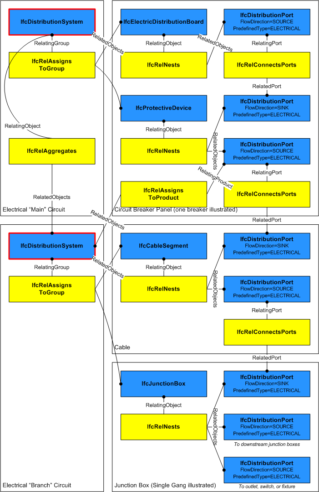

# IfcDistributionSystem

A distribution system is a network designed to receive, store, maintain, distribute, or control the flow of a distribution media. A common example is a heating hot water system that consists of a pump, a tank, and an interconnected piping system for distributing hot water to terminals.

The group _IfcDistributionSystem_ defines the occurrence of a specialized system for use within the context of building services or utilities for built facilities.

Important functionalities for the description of a distribution system are derived from existing IFC entities:

* From _IfcSystem_ it inherits the ability to couple the built system via _IfcRelReferencedInSpatialStructure_ to one or more _IfcSpatialElement_ subtypes as necessary.

* From _IfcGroup_ it inherits the inverse attribute IsGroupedBy, pointing to the relationship class _IfcRelAssignsToGroup_. This allows the grouping of distribution elements (instances of _IfcDistributionElement_ subtypes).

* From _IfcObjectDefinition_ it inherits the inverse attribute IsDecomposedBy pointing to the relationship class _IfcRelAggregates_. It provides the hierarchy between the separate (partial) distribution systems. For example, an electrical main circuit may be aggregated into branch circuits.

> HISTORY  New entity in IFC4.

{ .change-ifc2x4}
> IFC4 CHANGE  For electrical power systems, _IfcElectricalCircuit_ has been used for low-voltage (12-1000 V) power circuits and has been replaced by _IfcDistributionCircuit_ in IFC4; _IfcDistributionSystem_ with PredefinedType 'ELECTRICAL' should be used for overall power systems, and _IfcDistributionCircuit_ with PredefinedType 'ELECTRICAL' should be used for each switched circuit.

## Attributes

### LongName
Long name for a distribution system, used for informal purposes. It should be used, if available, in conjunction with the inherited _Name_ attribute.\X\0D
> NOTE  In many scenarios the _Name_ attribute refers to the short name or number of a distribution system or branch circuit, and the _LongName_ refers to a descriptive name.

### PredefinedType

## Formal Propositions

### CorrectPredefinedType
Either the _PredefinedType_ attribute is unset, or the inherited attribute _ObjectType_ shall be provided, if the _PredefinedType_ is set to USERDEFINED.

## Concepts

### Aggregation

### Group Assignment

For the most common case of an IfcDistributionElement subtype containing ports of a particular PredefinedType that all belong to the same distribution system, the IfcDistributionElement is assigned to the IfcDistributionSystem via the IfcRelAssignsToGroup relationship, where IfcDistributionPort's are implied as part of the corresponding system based on their PredefinedType. An IfcDistributionElement may belong to multiple systems, however only one IfcDistributionSystem of a particular PredefinedType.

For rare cases where an IfcDistributionElement subtype contains ports of the same PredefinedType yet different ports belong to different systems, alternatively each IfcDistributionPort may be directly assigned to a single IfcDistributionSystem via the IfcRelAssignsToGroup relationship, where the PredefinedType must match. Such assignment indicates that the IfcDistributionSystem assigned from the IfcDistributionPort overrides any such system of the same PredefinedType assigned from the containing IfcDistributionElement, if any.

Additionally, an IfcDistributionSystem may in turn be assigned to an IfcDistributionPort indicating the host or origination of the system using IfcRelAssignsToProduct.

>
> EXAMPLE  A gas-powered hot water heater may have three ports: GAS, DOMESTICCOLDWATER, and DOMESTICHOTWATER. The heater is a member of two systems (GAS and DOMESTICCOLDWATER), and hosts one system (DOMESTICHOTWATER) at the corresponding port.
>

Figure 303 illustrates a distribution system for an electrical circuit.

Figure 303 — Distribution system assignment

### Property Sets for Objects

