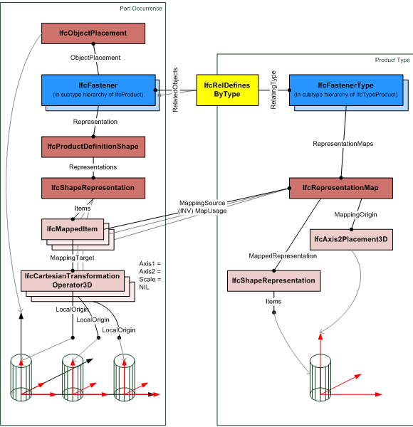

# IfcElementComponent

An element component is a representation for minor items included in, added to or connecting to or between elements, which usually are not of interest from the overall building structure viewpoint. However, these small parts may have vital and load carrying functions within the construction. These items do not provide any actual space boundaries. Typical examples of _IfcElementComponent_s include different kinds of fasteners and various accessories.
<!-- end of short definition -->

One or several instances of subtypes of _IfcElementComponent_ should always be accompanied by a defining instance of a respective subtype of _IfcElementComponentType_. The type object holds shape and material information.

> HISTORY New entity in IFC2x2

It is often desirable to model a number of same-shaped element components by means of a single occurrence object, e.g. several bolts within a connection or a row of reinforcement elements. In this IFC release, this is possible by means of multiple mapped representation as documented below.

To express the multiplicity of element components also on a higher semantic level, a _Qto_ElementComponentPatternQuantities_ should be provided via _IfcRelDefinesByProperties_ and contain the number of pieces which are placed by a single _IfcElementComponent_ instance.

{ .use-head}
**Symbolic Representation**

A symbolic representation is defined for a row of components or several rows of components within a single instance of _IfcElementComponent_. Such rows or arrays may contain possibly large numbers of individual pieces. The product definition shape consists of an _IfcShapeRepresentation_ with the attribute values

* _RepresentationIdentifier_ : 'Row'
* _RepresentationType_ : 'GeometricCurveSet'

and one or several curves as geometric items. The curves represent where reference points of the pieces are located. For example, such reference points may be at the heads of mechanical fasteners or at the starting point of the extrusion axis of reinforcement bars. In case of straight components (bolts, nails, staples, straight reinforcement bars, or similar), the local placement of the _IfcElementComponent_ shall be located and oriented such that the local z axis is parallel with the axes of the components. A _Qto_ElementComponentPatternQuantities_ should denote the count of pieces in the row or array and their spacing.

## Concepts

### Mapped Geometry

The mapped item, IfcMappedItem, should be used if appropriate as it allows for reusing the geometry definition of a type at all occurrences of the same type.

A single instance of a subtype of IfcElementComponent can stand for several
actual element components at once. In this case, the IfcShapeRepresentation
contains as many mapped items as there are element components combined within this
 occurrence object.

Figure 304 — Element component mapped representation

> EXAMPLE  Figure 304 illustrates multiple components modeled as a single occurrence object (here: IfcFastener)

Representation identifier and type are the same as in single mapped representation.
The number of mapped items in the representation corresponds with the count of
element components in the IfcElementQuantity.

### Property Sets for Objects

