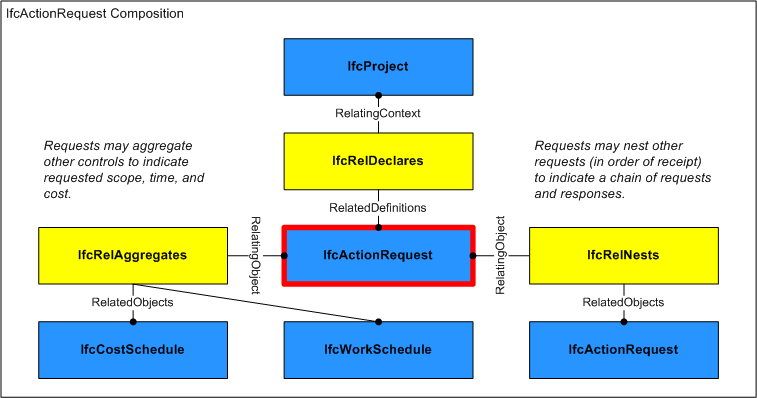
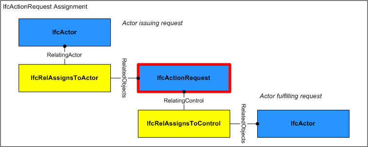

# IfcActionRequest

A request is the act or instance of asking for something, such as a request for information, bid submission, or performance of work.

Requests may take many forms depending on the need including fault reports for maintenance, requests for small works, and purchase requests (where these are to be made through a help desk or buying function).

> HISTORY  New entity in IFC2x2.

{ .change-ifc2x4}
> IFC4 CHANGE  Attribute _RequestID_ renamed to _Identification_ and promoted to supertype _IfcControl_, attributes _PredefinedType_, _Status_, and _LongDescription_ added.

## Attributes

### PredefinedType
Identifies the predefined type of sources through which a request can be made.

{ .change-ifc2x4}
> IFC4 CHANGE The attribute has been added.

### Status
The status currently assigned to the request.  Possible values include:
Hold: wait to see if further requests are received before deciding on action
NoAction: no action is required on this request
Schedule: plan action to take place as part of maintenance or other task planning/scheduling
Urgent: take action immediately
{ .change-ifc2x4}
> IFC4 CHANGE The attribute has been added.

### LongDescription
Detailed description of the permit.

{ .change-ifc2x4}
> IFC4 CHANGE The attribute has been added.

## Concepts

### Aggregation

As shown in Figure 1, an **IfcActionRequest** may be aggregated into components.

#### IfcCostSchedule

Cost schedules may indicate the costs projected or incurred for the request.

### Approval Association

Approvals may be associated to indicate the status of acceptance or rejection using the [IfcRelAssociatesApproval](../../ifccontrolextension/lexical/ifcrelassociatesapproval.htm) relationship where RelatingApproval refers to an [IfcApproval](../../ifcapprovalresource/lexical/ifcapproval.htm) and RelatedObjects contains the **IfcActionRequest**. Approvals may be split into sub-approvals using [IfcApprovalRelationship](../../ifcapprovalresource/lexical/ifcapprovalrelationship.htm) to track approval status separately for each party where RelatingApproval refers to the higher-level approval and RelatedApprovals contains one or more lower-level approvals. The hierarchy of approvals implies sequencing such that a higher-level approval is not executed until all of its lower-level approvals have been accepted.

### Control Assignment

As shown in Figure 1, an **IfcActionRequest** may be assigned to the following entities using relationships as indicated:

* [IfcActor](../../ifckernel/lexical/ifcactor.htm) ([IfcRelAssignsToActor](../../ifckernel/lexical/ifcrelassignstoactor.htm)): Person or organization issuing the request such as a tenant or owner.

The **IfcActionRequest** may have assignments of its own using the [IfcRelAssignsToControl](../../ifckernel/lexical/ifcrelassignstocontrol.htm) relationship where RelatingControl refers to the **IfcActionRequest** and RelatedObjects contains one or more objects of the following types:

* [IfcActor](../../ifckernel/lexical/ifcactor.htm): Person or organization(s) fulfilling the request such as a facilities manager or contractor. 

### Object Nesting

#### IfcActionRequest

A request may be nested into follow-up requests, in order of issue

### Property Sets for Objects

