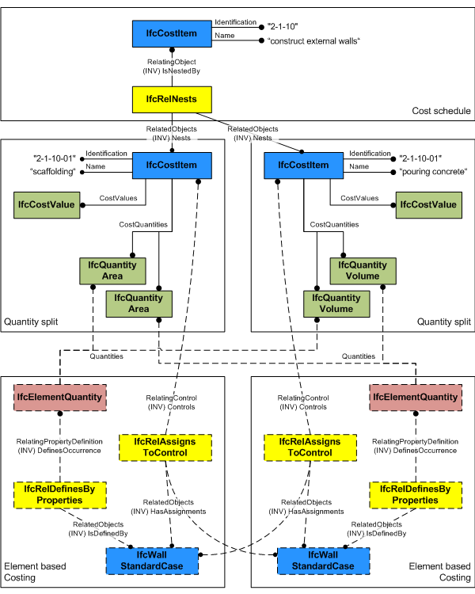
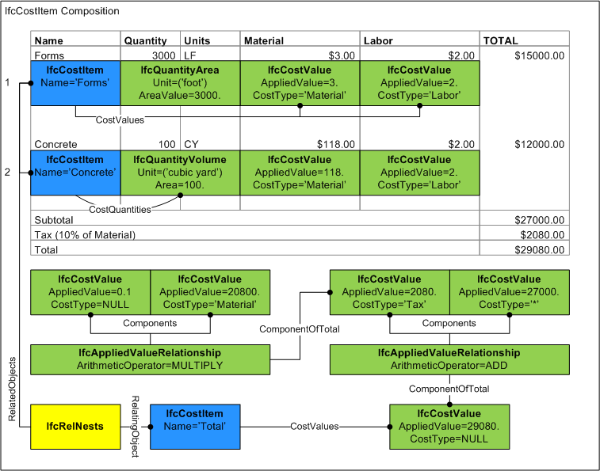

# IfcCostItem

An _IfcCostItem_ describes a cost or financial value together with descriptive information that describes its context in a form that enables it to be used within a cost schedule. An _IfcCostItem_ can be used to represent the cost of goods and services, the execution of works by a process, lifecycle cost and more.

Each instance of _IfcCostItem_ may have a name and a description. Depending on the use for which the cost is intended, these values should be asserted on the basis of agreement. For instance, the _Name_ attribute could be used to provide a common value that enables distinct instances to be brought together in a nesting arrangement (see below) while the Description attribute may be used to provide text used for item description in a costing schedule.

An _IfcCostItem_ can link one or many _IfcCostValue_'s representing a unit cost, total cost, or a unit cost with one or many quantities used to generate the total cost. The quantities can be given as individual quantities, or those quantities are provided as element quantities by one or many building elements. The _IfcCostValue.CostType_ attribute indicates the category of cost, which may be used to present the value in a particular column. For nested cost items (having _IfcRelNests_ relationship), _IfcCostValue.CostType_ is significant such that _IfcCostValue.AppliedValue_ is calculated as the sum of all nested costs having the same _IfcCostValue.CostType_ or if set to an asterisk ('\*'), then the sum of all nested costs of all cost types. An _IfcCostValue_ may represent an original value or a value derived from formulas using _IfcAppliedValueRelationship_. For example, taxes may be calculated as a percentage of a subtotal.

> HISTORY  New entity in IFC2.0.

{ .change-ifc2x4}
> IFC4 CHANGE  Attribute _PredefinedType_, _CostValues_, and _CostQuantities_ added.

## Attributes

### PredefinedType
Predefined generic type for a cost item that is specified in an enumeration. There may be a property set given specifically for the predefined types.

{ .change-ifc2x4}
> IFC4 CHANGE The attribute has been added.

### CostValues
Component costs for which the total cost for the cost item is calculated, and then multiplied by the total _CostQuantities_ if provided.  

If _CostQuantities_ is provided then values indicate unit costs, otherwise values indicate total costs.

For calculation purposes, the cost values may be directly added unless they have qualifications.  Cost values with qualifications (e.g. _IfcCostValue.ApplicableDate_, _IfcCostValue.FixedUntilDate_) should be excluded from such calculation if they do not apply.

{ .change-ifc2x4}
> IFC4 CHANGE The attribute has been added.

### CostQuantities
Component quantities of the same type for which the total quantity for the cost item is calculated as the sum.
{ .change-ifc2x4}
> IFC4 CHANGE The attribute has been added.

## Concepts

### Classification

Instances of IfcCostItem are used for cost estimates, budgets, and other forms, where a variety of identification codes are used extensively to identify the meaning of the cost. Examples include project phase codes, CSI codes, takeoff sequence numbers, and cost accounts. The model allows for all classes that are ultimately subtypes of IfcObject to inherit the ability to have one or more instances of IfcClassificationReference to be assigned. Where identification codes are required, the generic IfcRelAssociatesClassification facility should be used.

### Control Assignment

An IfcCostItem can be calculated based on quantities from objects through its relationship to IfcRelAssignsToControl.

For quantity-based costing, IfcElement, IfcTask, or IfcResource occurrence subtypes may be used. Multiple elements may be assigned of the same or different types, using IfcPhysicalQuantity entities defined at each object. Each IfcPhysicalQuantity type must be identical (for example, all values are IfcAreaQuantity) such that they can be added together.

For rate-based costing (specifically for IfcCostScheduleTypeEnum.SCHEDULEOFRATES), a single IfcTypeProduct, IfcTypeProcess, or IfcTypeResource subtype may be used to reflect rates for occurrences of such types. This enables the possibility to generate a quantity-based cost schedule for occurrences based on types with rate-based cost schedules.

IfcRelAssignsToControl is also used in the opposite direction to link the root IfcCostItem to an IfcCostSchedule where RelatingControl is the IfcCostSchedule. 

Figure 311 illustrates cost item assignment derived from building elements. The IfcRelAssignsToControl relationship indicates building elements for which quantities are derived. Not shown, costs may also be derived from building elements by traversing assignment relationships from the assigned IfcProduct to IfcProcess to IfcResource, where all costs ultimately originate at resources. It is also possible for cost items to have assignments from processes or resources directly.

Figure 311 — Cost assignment

### Nesting

An IfcCostItem can nest other instances of IfcCostItem through its relationships to IfcRelNests. This can be used to enable the development of complex groups of costs as may be found in cost schedules through to pages, sections and complete cost schedules.

There is always a summary cost item as the root item of the tree representing the cost item nesting. Subsequent instances of IfcCostItem are assigned to the summary cost item using IfcRelNests. The summary cost item itself is assigned to IfcCostSchedule through the IfcRelAssignsToControl relationship.

Figure 310 illustrates a cost item composition used for a cost schedule. Each line item has a quantity and separate unit costs where IfcCostValue.CostType indicates the category of cost. The summary item has a hierarchy of costs calculated according to IfcAppliedValueRelationship.ArithmeticOperator, where IfcCostValue.CostType identifies the category to be totalled. The Tax component has IfcCostValue.CostType set to 'Material' which indicates it is the sum of all nested values of the 'Material' category ($3 x 3000 + $118 x 100 = $20800). The Subtotal component has IfcCostValue.CostType set to an asterisk ('*') which indicates it is the sum of all nested values of all categories.

Figure 310 — Cost composition

