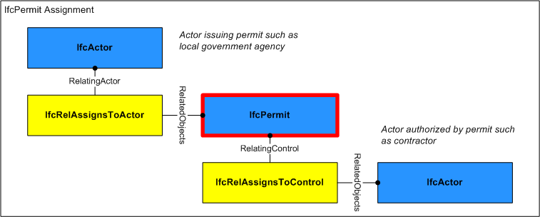

# IfcPermit

A permit is a permission to perform work in places and on artifacts where regulatory, security or other access restrictions apply.

> HISTORY  New entity in IFC2x2.

{ .change-ifc2x4}
> IFC4 CHANGE  Attribute _PermitID_ renamed to _Identification_ and promoted to supertype _IfcControl_, attributes _PredefinedType_, _Status_, and _LongDescription_ added.

## Attributes

### PredefinedType
Identifies the predefined types of permit that can be granted.

{ .change-ifc2x4}
> IFC4 CHANGE The attribute has been added.

### Status
The status currently assigned to the permit.

{ .change-ifc2x4}
> IFC4 CHANGE The attribute has been added.

### LongDescription
Detailed description of the request.

{ .change-ifc2x4}
> IFC4 CHANGE The attribute has been added.

## Concepts

### Aggregation

### Approval

Approvals may be associated to indicate the status of acceptance or rejection using the *IfcRelAssociatesApproval* relationship where RelatingApproval refers to an *IfcApproval* and RelatedObjects contains the *IfcPermit*. Approvals may be split into sub-approvals using *IfcApprovalRelationship* to track approval status separately for each party where RelatingApproval refers to the higher-level approval and RelatedApprovals contains one or more lower-level approvals. The hierarchy of approvals implies sequencing such that a higher-level approval is not executed until all of its lower-level approvals have been accepted.

### Control Assignment

Figure 312 illustrates assignment relationships as indicated:

* IfcActor (IfcRelAssignsToActor): Organization issuing the permit such as a local government agency or security organization.

 The IfcPermit may have assignments of its own using the IfcRelAssignsToControl relationship where RelatingControl refers to the IfcPermit and RelatedObjects contains one or more objects of the following types: 

* IfcActor: Organization(s) bound to the permit, typically a single contractor.

Figure 312 — Permit assignment

### Nesting

### Property Sets for Objects

