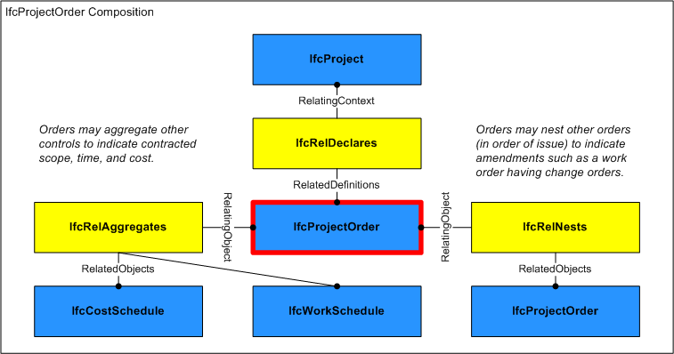
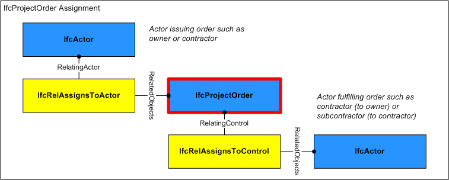

# IfcProjectOrder

A project order is a directive to purchase products and/or perform work, such as for construction or facilities management.<!-- end of definition -->

Project orders are typically formal contracts between two organizations, where cost and time information may be rigid or flexible according to contained schedule types and constraints.

> HISTORY  New entity in IFC2.0

{ .change-ifc2x4}
> IFC4 CHANGE  Attribute _ID_ renamed to _Identification_ and promoted to supertype _IfcControl_. Attribute 'LongDescription' added.

## Attributes

### PredefinedType
Predefined generic type for a project order that is specified in an enumeration. There may be a property set given specifically for the predefined types.

{ .change-ifc2x4}
> IFC4 CHANGE The attribute has been made optional.

### Status
The current status of a project order.Examples of status values that might be used for a project order status include:
* PLANNED
* REQUESTED
* APPROVED
* ISSUED
* STARTED
* DELAYED
* DONE

### LongDescription
A detailed description of the project order describing the work to be completed.

## Concepts

### Aggregation

As shown in Figure 160, an IfcProjectOrder may be aggregated into components.

Figure 313 — Project order composition

#### WORKORDER_IfcCostSchedule

A cost schedule may indicate costs and quantities where the cost schedule type may designate whether rates and/or quantities are estimated or final.  Such cost schedule may have assigned cost items indicating detail, where each cost item may have assigned products, processes, or resources.

### Approval Association

Approvals may be associated to indicate the status of acceptance or rejection using the IfcRelAssociatesApproval relationship where RelatingApproval refers to an IfcApproval and RelatedObjects contains the IfcProjectOrder. Approvals may be split into sub-approvals using IfcApprovalRelationship to track approval status separately for each party where RelatingApproval refers to the higher-level approval and RelatedApprovals contains one or more lower-level approvals. The hierarchy of approvals implies sequencing such that a higher-level approval is not executed until all of its lower-level approvals have been accepted.

### Control Assignment

Figure 314 illustrates IfcProjectOrder assignment relationships as indicated:

* *IfcActor* (*IfcRelAssignsToActor*): Organization issuing the order such as an owner or contractor.

 The IfcProjectOrder may have assignments of its own using the *IfcRelAssignsToControl* relationship where RelatingControl refers to the IfcProjectOrder and RelatedObjects contains one or more objects of the following types:

* *IfcActor*: Organization(s) contracted to fulfill the order, typically a single contractor, subcontractor, or supplier.

Figure 314 — Project order assignment

### Object Nesting

#### IfcProjectOrder

May contain subordinate orders, particularly change orders indicating contract amendment in order of issue.

### Property Sets for Objects

