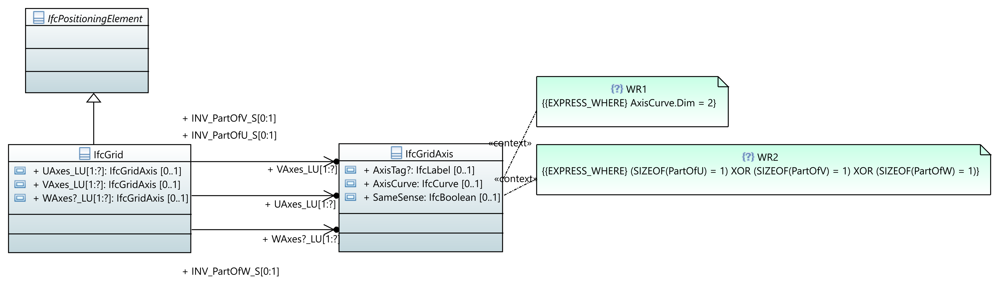
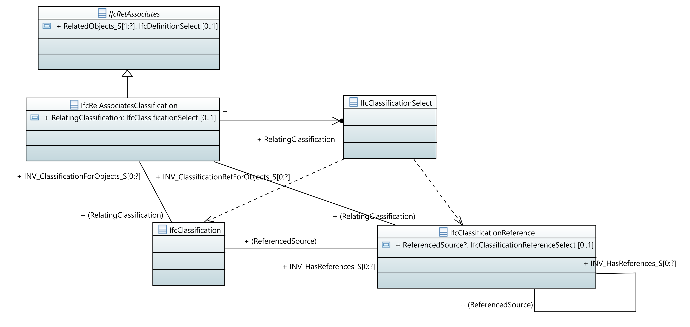
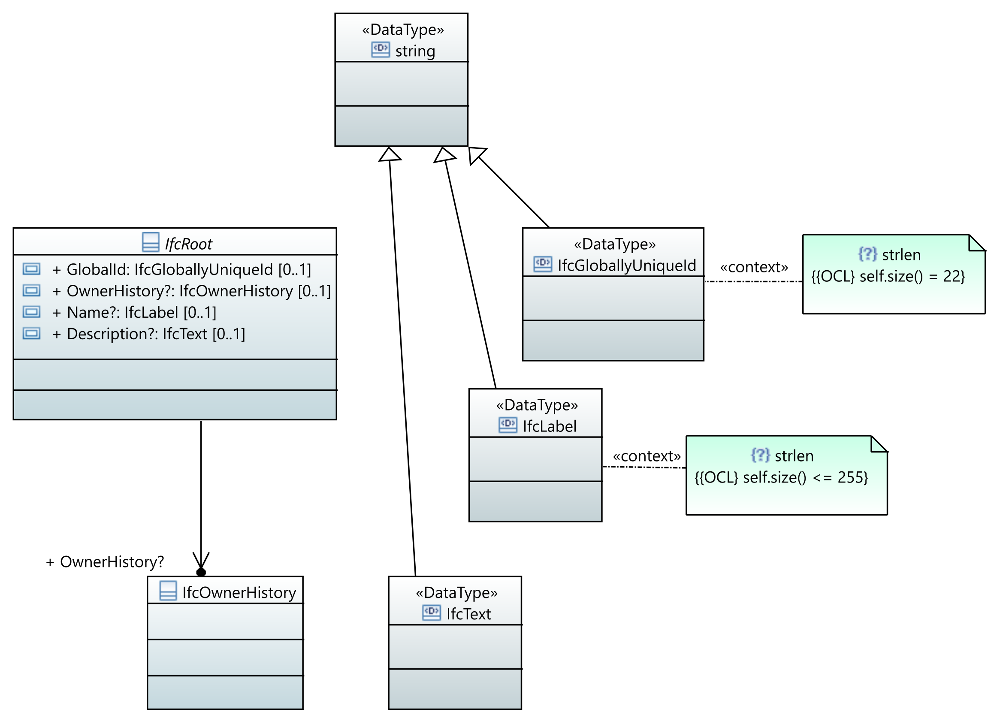
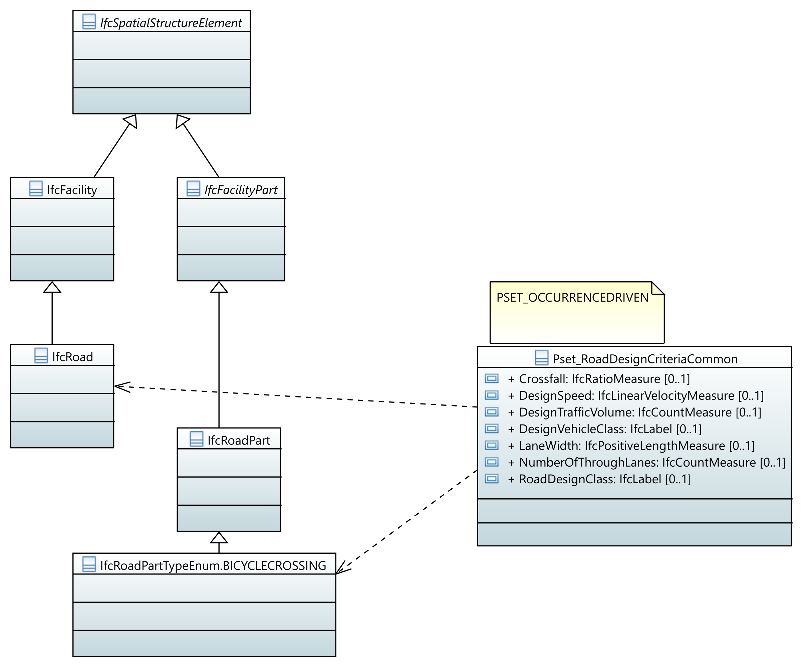
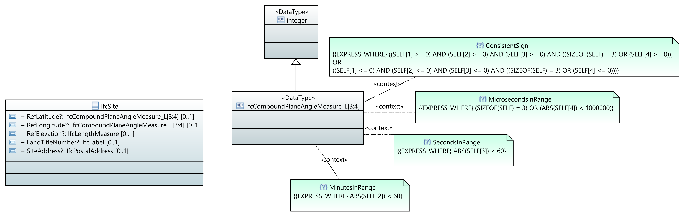
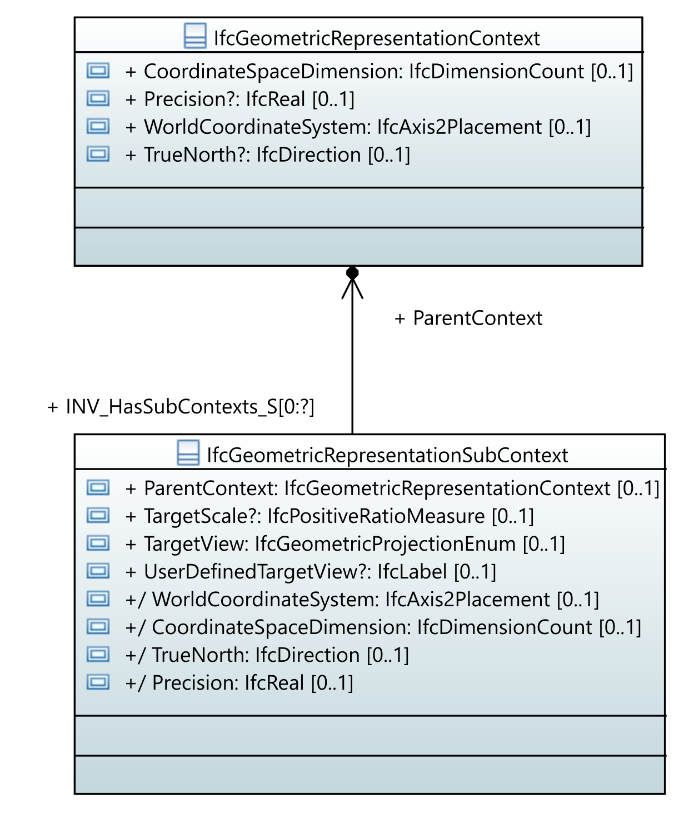

# UML Modelling conventions for IFC EXPRESS

## Background

Starting from IFC4.3, the editable master copy of the schema is maintained in a UML model serialized as XMI (an XML representation of UML). Initially this was a monolithic file with a large extension blob originating from proprietary software. Over time this has been cleaned-up into a modular and succinct file with good data locality. The IFC subschemas such as IfcKernel.uml are imported packages. This way, edits stay focussed and reviewable. The aim here is not to have a one-to-one mapping to UML semantics, the aim is to be able to use the plethora of UML modelling tools for schema maintenance in a familiar idiom. As such, the style of modelling at times resembles EXPRESS-G somewhat in a UML container.

## Modeling conventions

UML is not EXPRESS. For example, the model behind cardinalities is different. EXPRESS has OPTIONAL and non-OPTIONAL attributes in addition to four categories of aggregates (ARRAY, BAG, LIST, SET). Here ARRAY and LIST are ordered aggregates, with LIST variable length. BAG and SET are (multi-) sets. LISTS can also be marked to contain UNIQUE elements. Most importantly, such aggregates can be nested, for example: `LIST [1:?] OF LIST [3:?] OF UNIQUE IfcPositiveInteger` for the attribute `InnerCoordIndices` on ENTITY `IfcIndexedPolygonalFaceWithVoids`. Mapping this to UML would necessitate a classifier to represent the nested list. In order to improve data locality, succinctness and visual clarity for EXPRESS-minded people, the choice has been made to encode the aggregation (and optionality) structures more or less verbatim into the attribute names and not to attempt to use (and hence ignore) the UML multiplicities (except in the case of Pset_ property types).



*schema diagram highlighting aggregate association names and where rules*

```xml
<packagedElement xmi:type="uml:Class" xmi:id="cl_IfcGrid" name="IfcGrid">
    <generalization xmi:type="uml:Generalization" xmi:id="gen_10014" general="cl_IfcPositioningElement"/>
    <ownedAttribute xmi:type="uml:Property" xmi:id="at_IfcGrid_UAxes" name="UAxes_LU[1:?]" isOrdered="false" association="as_IfcGrid_UAxes">
        <type xmi:type="uml:Class" href="IfcGeometricConstraintResource.uml#cl_IfcGridAxis"/>
        <lowerValue xmi:type="uml:LiteralInteger" xmi:id="lower_10015" value="0"/>
        <upperValue xmi:type="uml:LiteralUnlimitedNatural" xmi:id="upper_10016" value="1"/>
    </ownedAttribute>
    ...
</packagedElement>
```


```xml
<packagedElement xmi:type="uml:Class" xmi:id="cl_IfcGridAxis" name="IfcGridAxis">
    ...
    <ownedRule xmi:type="uml:Constraint" xmi:id="ct_IfcGridAxis_WR1" name="WR1">
        <specification xmi:type="uml:OpaqueExpression" xmi:id="expr_3036" name="WR1">
        <language>EXPRESS_WHERE</language>
        <body>AxisCurve.Dim = 2</body>
        </specification>
    </ownedRule>
```

### Asymmetric inverses

Both UML and EXPRESS allow to name the opposite end of a relationship and constrain the cardinality of opposite direction. However, in the case of EXPRESS this inverse is not necessarily symmetric, i.e., it can be defined on a more specific level than the forward relationship points to. This can occur in the case of entity subtyping, but also in selections within union types (SELECT). In the case below the `RelatingClassification` attribute points to a `SELECT` and the inverse relationship is defined for both concrete options in this select. For the serialization in EXPRESS we do need to know the name of the forward relationship. The convention is to encode this name in parentheses in order to indicate this is a suppressed relationship to name the attribute associated with the inverse.



*asymmetric inverses related to IfcClassificationSelect*

```xml
<packagedElement xmi:type="uml:Association" xmi:id="as_IfcClassification_ClassificationForObjects" name="IfcClassification_ClassificationForObjects" memberEnd="end_983 end_984">
    <ownedEnd xmi:type="uml:Property" xmi:id="end_983" name="(RelatingClassification)" association="as_IfcClassification_ClassificationForObjects">
        <type xmi:type="uml:Class" href="IfcExternalReferenceResource.uml#cl_IfcClassification"/>
        <lowerValue xmi:type="uml:LiteralInteger" xmi:id="lower_4433" value="0"/>
        <upperValue xmi:type="uml:LiteralUnlimitedNatural" xmi:id="upper_4434" value="1"/>
    </ownedEnd>
    <ownedEnd xmi:type="uml:Property" xmi:id="end_984" name="INV_ClassificationForObjects_S[0:?]" association="as_IfcClassification_ClassificationForObjects" type="cl_IfcRelAssociatesClassification">
        <lowerValue xmi:type="uml:LiteralInteger" xmi:id="lower_4435" value="0"/>
        <upperValue xmi:type="uml:LiteralUnlimitedNatural" xmi:id="upper_4436" value="1"/>
    </ownedEnd>
</packagedElement>
```

### String length data types

In EXPRESS, type declarations can encode constraints by means of where rules, but in the case of BINARY and TEXT the allowed length can be constrained in the type declaration itself. IfcGloballyUniqueId has a fixed length of exactly 22: `TYPE IfcGloballyUniqueId = STRING(22) FIXED;`. IfcLabel has a maximum length of 255: `TYPE IfcLabel = STRING(255);`. In the convention this is encoded in OCL.



*encoding of string length constraints in OCL*

```xml
<packagedElement xmi:type="uml:DataType" xmi:id="dt_IfcGloballyUniqueId" name="IfcGloballyUniqueId">
    <generalization xmi:type="uml:Generalization" xmi:id="gen_11259">
        <general xmi:type="uml:DataType" href="ifc4x3_add2.uml#dt_string"/>
    </generalization>
    <ownedRule xmi:type="uml:Constraint" xmi:id="ct_strlen" name="strlen">
        <specification xmi:type="uml:OpaqueExpression" xmi:id="expr_11260" name="strlen">
        <language>OCL</language>
        <body>self.size() = 22</body>
        </specification>
    </ownedRule>
</packagedElement>
```

### Property sets and predefined types

Property sets are not part of the EXPRESS specification, but are present in the UML model because they have a class-like shape and have relationships to schema entities. There is no stereotype to identify these; these are identified solely by the conventional string prefix of `Pset_` or `Qto_`. The "template type" (which governs occurrence-type override behavior) is encoded in a comment. The relationships to allowed entities are expressed as an `uml:Dependency`. In several cases, property sets are only applicable to specific predefined types (a special case of subtyping by means of an enumeration attribute) within an entity. In order to realize the association between property sets in these cases, the predefined type values are present as enumeration labels in UML, but also as uml:Class subtypes. The dot (`"."`) in the name is the pattern by which these are excluded as classes from the EXPRESS serialization.

There are several property types:

- Single value: data type reference with multiplicity 0..1
- List value: data type reference with multiplicity 0..*
- Bounded value: data type reference with comment "BOUNDED"
- Reference value: class type reference with multiplicity 0..1
- Enumeration value: uml:Enumeration reference that starts with `Penum_` to exclude from EXPRESS serialization
- Table value: uml:Class with DefiningValue and DefinedValue attribute that inherits from a type named `PropertyTableValueBase` 
- Physical quantity: reference to `IfcAreaMeasure`/`IfcLengthMeasure`/etc. and part of a uml:Class prefix `Qto_`



*Property set association to entities and predefined types (note the diagram is not complete, this pset is applicable to more entries)*

### Simple type aggregations and where rules

As mentioned, aggregates are encoded into the attribute names. The same applies to simple types that declare their underlying type to be an aggregate.



*Simple type declarations as aggregates and where rules*

### Derived attributes and attributes redeclared as derived in a subtype

EXPRESS allows to define derived attributes. These are encoded as defaultValues in UML. A special case is attributes redeclared as derived in a subtype. In the UML convention this is simply accomplished by equality of the attribute names. The EXPRESS serializer takes care of serializing this properly.



```xml
<packagedElement xmi:type="uml:Class" xmi:id="cl_IfcGeometricRepresentationSubContext" name="IfcGeometricRepresentationSubContext">
    ...
    <ownedAttribute xmi:type="uml:Property" xmi:id="at_IfcGeometricRepresentationSubContext_WorldCoordinateSystem" name="WorldCoordinateSystem" isOrdered="false" isDerived="true">
        <type xmi:type="uml:Class" href="IfcGeometryResource.uml#un_IfcAxis2Placement"/>
        <lowerValue xmi:type="uml:LiteralInteger" xmi:id="lower_2058" value="0"/>
        <upperValue xmi:type="uml:LiteralUnlimitedNatural" xmi:id="upper_2059" value="1"/>
        <defaultValue xmi:type="uml:OpaqueExpression" xmi:id="expr_2060" name="WorldCoordinateSystem">
            <language>EXPRESS</language>
            <body>IfcAxis2Placement := ParentContext.WorldCoordinateSystem</body>
        </defaultValue>
    </ownedAttribute>
```
